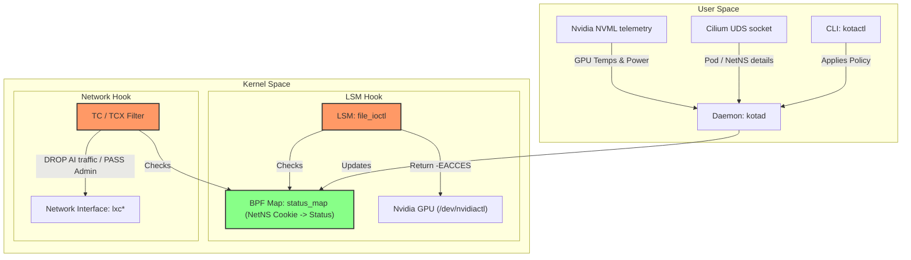
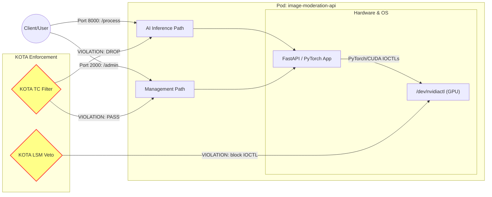

# KOTA: Kernel Oversight for Trusted AI (కోట)

> **Architectural Status:** Architecture-Validated Reference Model / Systems Prototype
> **License:** Apache 2.0
> **Target Environment:** Linux Kernel 6.6+ (CO-RE, TCX, LSM)
> **Core Stack:** C (eBPF Data Plane) / C++23 (Sovereign Daemon) / Go (Control Plane CLI)

---

## 📺 Architecture & Live Demo Walkthrough
-----
Watch the full system architecture breakdown and live cluster enforcement demo here:  
**[KOTA Architecture & Live Demo Walkthrough (YouTube)](https://youtu.be/zDdDcGgEjJI)**

---

## 1. The Core Thesis: Bridging the GPU Observability Gap

At [KubeCon Europe 2026](https://youtu.be/mkH38O3wLog?si=iHetec2fnPII0CAx), the cloud-native infrastructure landscape explicitly exposed the **"Visibility Illusion"**—the critical performance and security blind spot caused by treating accelerator hardware metrics (NVML/DCGM) and network fabric routing as decoupled abstractions. When multi-tenant GPU nodes experience hardware faults, silent kernel stalls, thermal throttling, or unauthorized execution anomalies, traditional userspace orchestrators cannot intercept line-rate traffic instantly. This creates cascade bottlenecks, container zombie states, and cluster-wide training or inference deadlocks.

**KOTA is a highly optimized, polyglot systems architecture built to solve this exact dilemma.** Instead of relying on delayed userspace polling or out-of-band sidecars, KOTA establishes an **Atomic Hardware-to-Network Interlock** directly inside the Linux kernel data plane.

---

## 2. System Architecture & Topology

KOTA splits enforcement boundaries cleanly across three dedicated layers, prioritizing zero-overhead execution and precise resource isolation.

### A. KOTA Core Architecture



**Architecture Walkthrough:**
In User Space, KOTA runs the `kotad` daemon, acting as the control plane. Operators apply safety policies via the `kotactl` CLI, which publishes rules to the daemon. To correlate low-level events to high-level Kubernetes resources, `kotad` listens on a Unix Domain Socket to get pod metadata and network namespace details directly from Cilium, while simultaneously polling GPU telemetry (like temperature) using NVIDIA's NVML.

In Kernel Space, KOTA updates a shared BPF map called `status_map` mapping each container's network namespace cookie to its current verdict status. Two distinct enforcement hooks are deployed:
1. **LSM Hook (`file_ioctl`):** Checks the status map and blocks unauthorized GPU ioctl requests by returning a strict `EACCES` permission error when a violation is active.
2. **Network Hook (TCX Filter):** Attached to the host's virtual ethernet leg (`lxc*`), it checks the status map to drop AI traffic at sub-millisecond rates while seamlessly allowing administrative traffic to pass through.

### B. Selective AI Path Enforcement



**Enforcement Walkthrough:**
During normal operations, both the AI Inference Path (data path handling workload via FastAPI/PyTorch/CUDA) and the Admin Path (serving operational health checks) are fully functional. However, when KOTA triggers a **VIOLATION** state:
- KOTA's Traffic Control filter surgically intercepts and drops packets bound for the AI inference port, preventing any incoming workload processing.
- Simultaneously, KOTA's LSM Veto hook blocks the PyTorch/CUDA runtime from making direct NVIDIA driver ioctl system calls, neutralizing hardware utilization.
- Most importantly, KOTA leaves the admin port entirely untouched. Operators retain full observability and control of the container, enabling automated recovery when the system returns to a healthy state.

### Component Breakdown
1. **The Kernel Enforcement Engine (C / eBPF):** Utilizes stabilized `tcx` ingress hooks on host virtual ethernet boundaries (`lxc*` / `veth`) to execute sub-millisecond, port-aware packet filtering. Concurrently, it coordinates with `lsm/file_ioctl` hooks to construct an un-bypassable hardware gate directly on the `/dev/nvidia*` device driver layer.
2. **The Sovereign Identity Daemon (`kotad` / C++23):** Interfaces directly with hardware driver runtime states. It resolves local pod identity **"outside-in"** by traversing kernel `task_struct` and tracking network namespace (NetNS) inodes back to filesystem OCI container specifications (`config.json`). This ensures zero cloud-native API server dependencies, guaranteeing enforcement even during total cluster network partitions.
3. **The Control Operator (`kotactl` / Go):** Manages user-facing runtime configuration profiles, administrative overrides, and live metric verification pipes using high-speed gRPC over Unix Domain Sockets.

---

## 3. Advanced Design Engineering: Feature Matrix

* **Zero-Socket Sovereign Discovery:** Bypasses the Kubernetes API entirely for data-plane routing enforcement. Identity resolution is computed by evaluating the local operating system state, mapping Cgroup namespaces to network origins to eradicate **Network Identity Drift**.
* **Surgical Port-Aware Quarantine:** Unlike blunt "black-hole" approaches that drop a node completely offline, KOTA's `tcx` scalpel filters traffic dynamically. It halts standard inference/data endpoints under a violation state while leaving pre-configured management, debugging, or healing ports (e.g., SSH, telemetry, administrative gRPC channels) wide open for SRE remote remediation.
* **Device-Level Hardware Veto:** Implements a strict kernel-level lock on silicon. Rogue execution attempts inside a container (such as malicious `cudaMemcpy` escalations or unauthorized process shell spawn injections via `kubectl exec`) are checked at the `ioctl` boundary and denied with a hard `Exit Code 13 (-EACCES)` permission barrier.

---

## 4. Reference Architecture Status & Engineering Roadmap

KOTA is published as an **Architecture-Validated Systems Reference Model**. The current implementation is optimized to demonstrate the core kernel-to-userspace communication loop and the synchronous hardware-to-network interlock. To maintain readability in the reference design, the following engineering trade-offs were chosen, mapping our current production hardening roadmap:

### Asynchronous Namespace Events
* **Current Implementation:** The userspace daemon (`kotad`) parses host file paths (`/proc/[pid]/ns/net` and filesystem OCI metadata config files) using a synchronous polling pattern to resolve container identity.
* **Production Path:** For hyper-scale orchestration environments with massive container churn rates, this subsystem is designed to transition to an asynchronous `epoll` architecture or hook directly into `sched_process_exec` / `sched_process_exit` kernel tracepoints to handle identity lifecycles via pure event-driven mechanics.

### Fail-Fast Workload Recovery Bounds
* **Current Implementation:** Intercepting proprietary device driver calls via the eBPF LSM `file_ioctl` hook and returning `-EACCES` intentionally corrupts the active CUDA context of the targeted workload process. This forces un-instrumented application frameworks to crash cleanly and fail-fast natively.
* **Production Path:** For simple endpoints, this triggers a rapid, low-cost container restart via the local Kubernetes `kubelet` agent. For multi-node distributed training or heavy LLM deployment environments where reloading model weights into VRAM is expensive, KOTA is built to sit beneath multi-process inference models (such as NVIDIA Triton or vLLM). In those environments, KOTA forces the individual faulty GPU worker process to fail-fast, allowing the inference gateway to recycle the local worker context without causing a full container or pod restart.

### Ephemeral BPF Map Synchronization (Heartbeats)
* **Current Implementation:** Active policy state transitions are written explicitly to the kernel-resident eBPF `StatusMap` by the userspace daemon.
* **Production Path:** Production hardening requires implementing a Time-To-Live (TTL) or kernel-side counter heartbeat inside the eBPF map logic, ensuring the kernel gracefully falls back to a safe default policy if the userspace management plane ever becomes unresponsive.

### Configuration Schema Evolution
* **Current Implementation:** Runtime system variables (such as the UNIX socket path and eBPF map pinning paths) are currently compiled as immutable string primitives.
* **Production Path:** Production hardening involves migrating these to the existing YAML-backed configuration framework to allow multi-tenant environment flexibility.

---

## 5. Getting Started & Verification

> **Note:** To pass the End-to-End verification run, you must execute the validation script on a Linux host with an active NVIDIA GPU instance and `bpftool` installed in the expected system paths.

### Prerequisites
* Linux Kernel >= 6.6
* BPFTool and Clang/LLVM toolchain supporting CO-RE (Compile Once, Run Everywhere)
* Libbpf development headers

### Quick Compilation
```bash
# Clone the repository
git clone https://github.com/sai-kumar-peddireddy/KOTA.git && cd KOTA

# Compile the eBPF bytecode and C++ daemon
cmake -S . -B build && cmake --build build

# Compile the Go Control Plane CLI
cd cmd/kotactl && go build -o kotactl . && cd ../..

# Run the End-to-End network and GPU validation test script
sudo ./tests/manual/e2e_network_gpu.sh
```

---

*Built as an independent engineering exploration into hardware-coupled kernel state enforcement.*