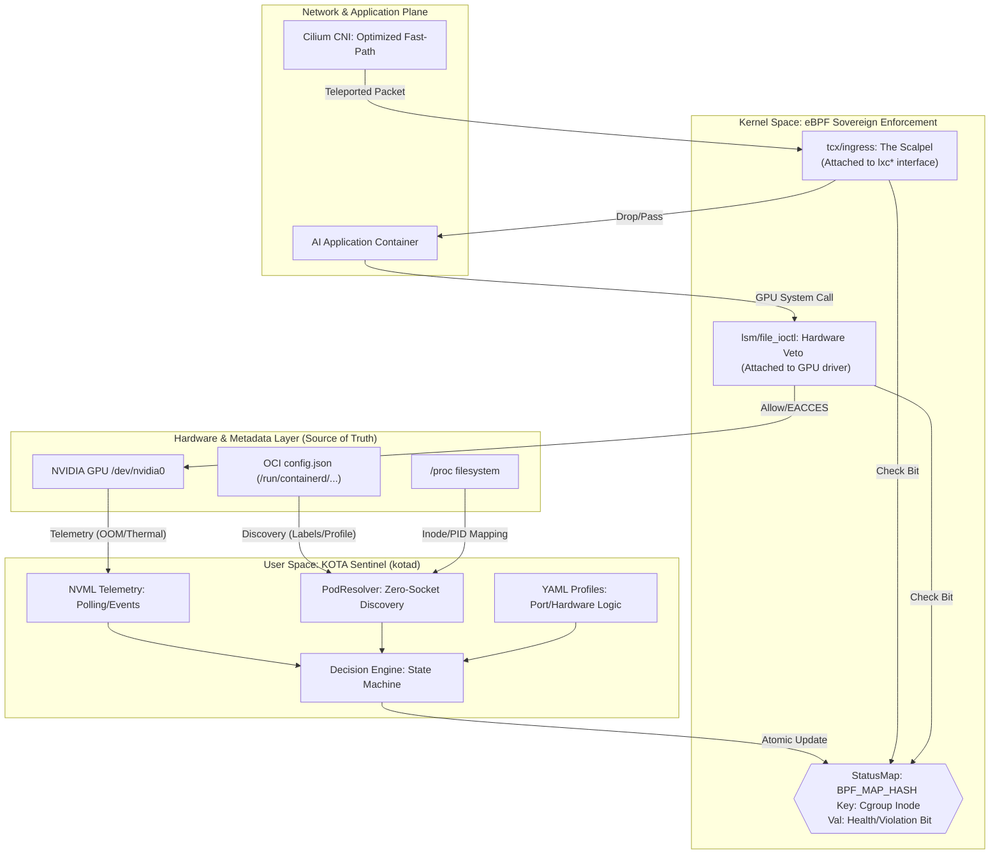

# KOTA — Kernel Oversight for Trusted AI

## High-Level Design (HLD) — Community Edition

> **Identity:** Sovereign Linux Sentinel (కోట). 
> **Core Mission:** A Hardware-to-Network Interlock that gates network traffic at the physical NIC based on real-time GPU hardware health and Seccomp-style behavioral profiles.

---

### Policy and verdicts

- **Profiles:** Port and hardware policy are defined in **YAML** files on the host; the Sentinel loads them by `profile_id` (from OCI labels at discovery time). OCI **`config.json`** remains the runtime metadata source for container identity and labels.
- **Verdicts:** Enforcement uses **ACTIVE** and **VIOLATION** only (see `docs/flow.md`). There is no separate quarantine tier in this edition.