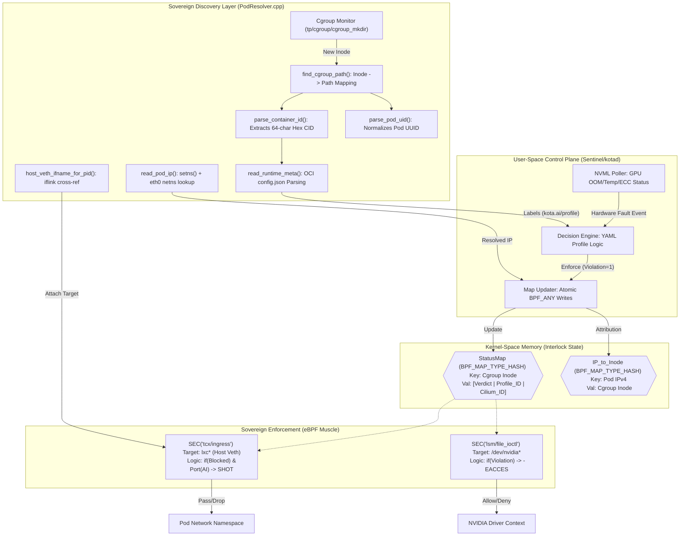

🏛️ Component Responsibilities
1. KOTAD Sentinel (User Space)
Health Coordination: Monitors real-time GPU metrics (OOM events, ECC errors, thermal throttling) via NVML.

State Management: Manages **ACTIVE** vs **VIOLATION** verdicts per pod (see `docs/flow.md`). There is no separate quarantine tier: a hardware breach moves the pod straight to enforced **VIOLATION**; recovery applies hysteresis before returning to **ACTIVE**.

Atomic Map Updates: Performs atomic BPF map updates to ensure enforcement is updated without dropping existing healthy connections.

2. PodResolver (Discovery Engine)
Zero-Socket Resolution: Discovers container metadata by parsing the OCI **config.json** and **/proc** filesystem. **Policy** (ports, thresholds, AI vs management classes) comes from **YAML** profile files selected by the `kota.ai/profile` label (or equivalent), not from JSON policy documents.

Namespace Traversal: Enters the pod's network namespace using setns() to verify the internal eth0 IP address.

Veth Correlation: Matches the pod's internal iflink to the host-side lxc* interface name, providing the target for the Scalpel.

3. StatusMap (The Interlock)
Decentralized Truth: Acts as the shared memory between the Sentinel (User Space) and the BPF programs (Kernel Space).

Immutable Keys: Uses the Cgroup Inode as the primary key to ensure security is tied to the physical container life cycle, even if the IP address changes.

Enforcement Context: Stores the Verdict (Allow/Block) and the Profile_ID, which dictates which specific ports are restricted during a fault.

4. TCX Scalpel (Network Gate)
Surgical Enforcement: Attached to the lxc* interface, catching packets after they have been translated/teleported by the CNI.

Port-Aware Logic: Inspects incoming TCP/UDP ports. It selectively drops "AI/Data" traffic while allowing "Management/Probe" traffic based on the Pod's profile.

5. LSM Veto (Hardware Gate)
The Final Backstop: Attached to the file_ioctl hook on the GPU device driver (/dev/nvidia*).

Dynamic Command Blocking: Intercepts GPU execution commands. If the Pod is in a violation state, the kernel returns -EACCES, preventing the application from running AI logic on the silicon.